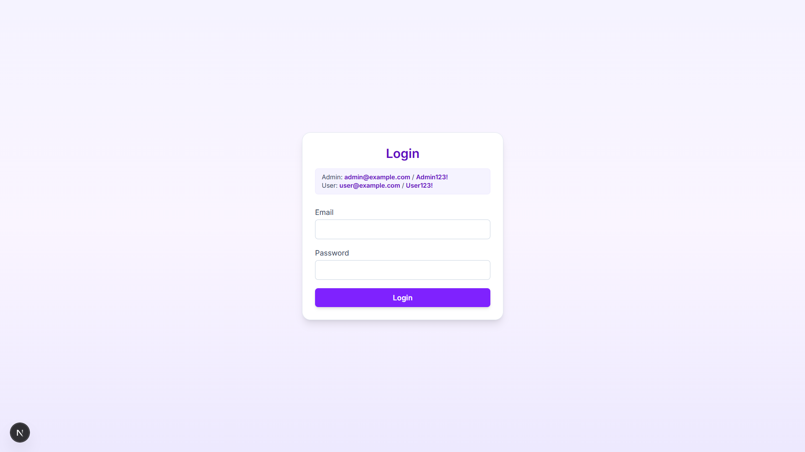
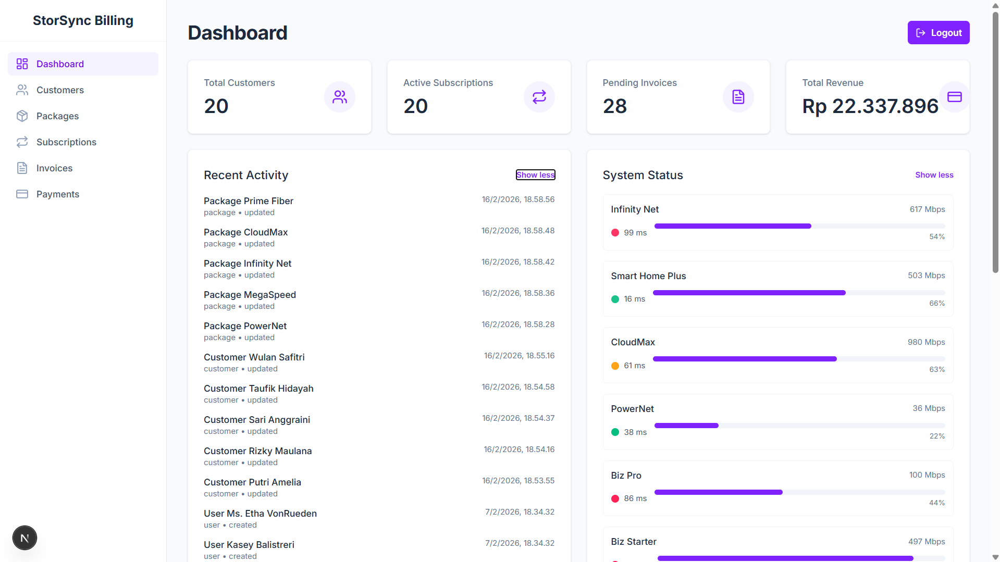
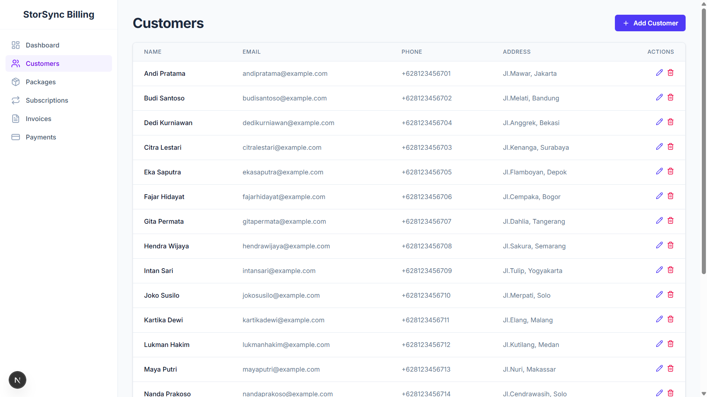
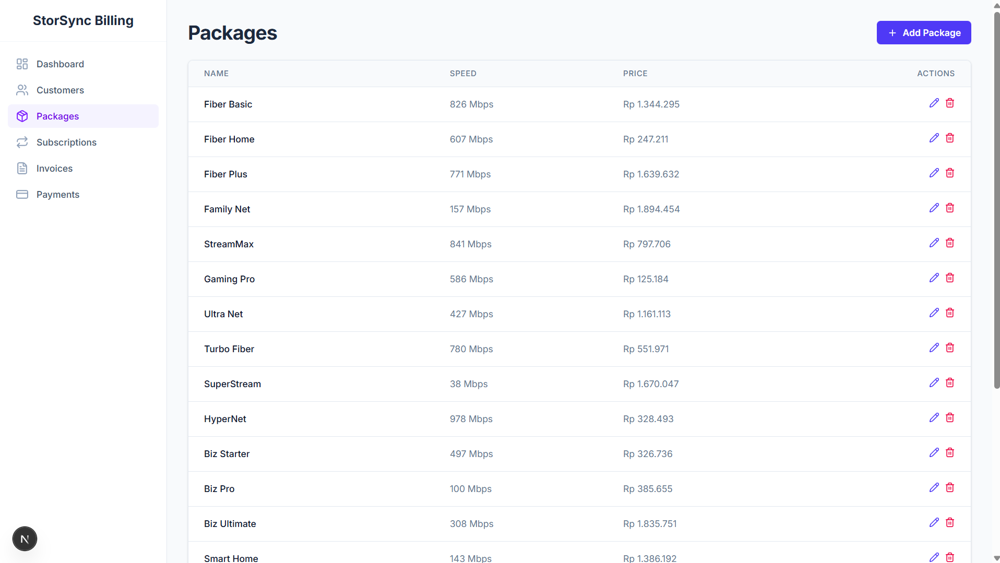
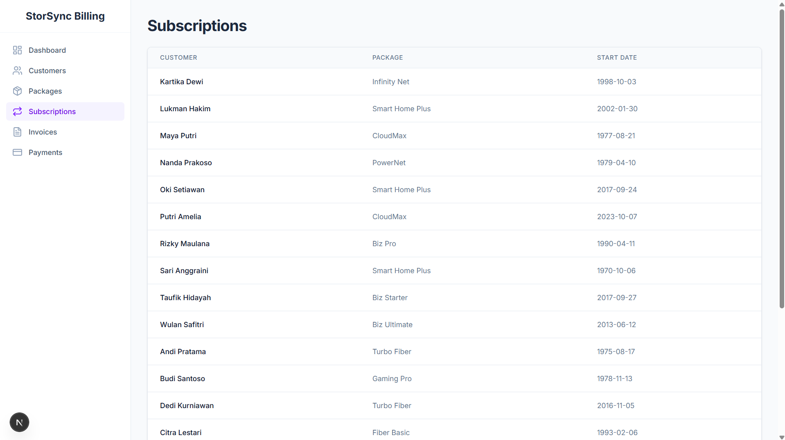
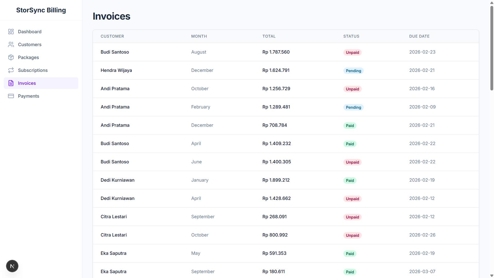
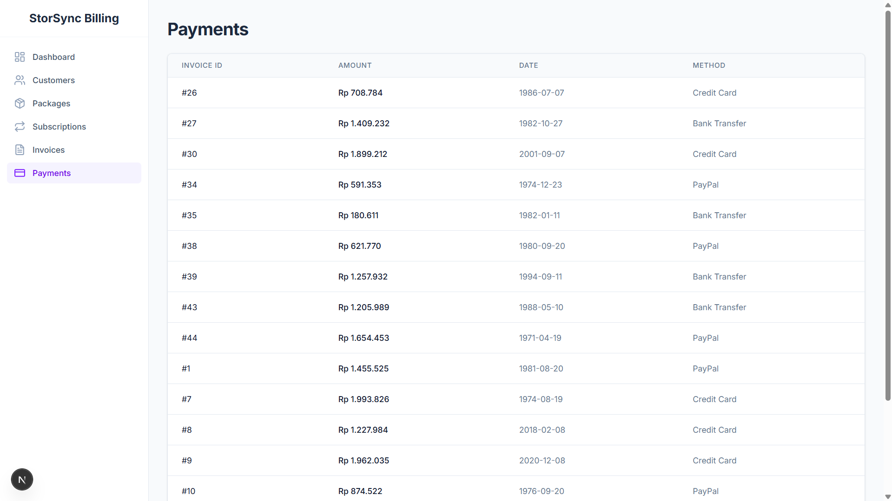

# StorSync Billing Dashboard

Billing management for internet/ISP services that enables customer, package, subscription, invoice, and payment management.

This project uses:
- Backend: Laravel (PHP)
- Frontend: Next.js
- Database: MySQL
- Local Environment: Laragon

---

## Key Features

- Authentication (Login / Logout)

  

- Statistics dashboard (Total Customers, Active Subscriptions, Pending Invoices, Total Revenue)
  
  
  
- Customer Management

  
  
- Package Management

  
  
- Subscription Management

  
  
- Invoice Management



- Payment Management



---

## Installation & Setup

1. **Clone Repository**
```bash
git clone https://github.com/username/storsync-billing-dashboard.git
cd storsync-billing-dashboard
```
   
2. **Backend Setup**
```bash
cd backend
composer install
```

3. **Copy Environment File**
```bash
cp .env.example .env
```

4. **Configure Database (.env)**
```bash
DB_CONNECTION=mysql
DB_HOST=127.0.0.1
DB_PORT=3306
DB_DATABASE=storsync_billing
DB_USERNAME=root
DB_PASSWORD=
```

5. **Generate Key, Migration & Seeder, Run Backend**
```bash
php artisan key:generate
php artisan migrate --seed
php artisan serve
```

The backend will run on:
```bash
http://127.0.0.1:8000
```

6. **Frontend Setup**
```bash
cd frontend
npm install
```

7. **Create a .env.local file**
```bash
NEXT_PUBLIC_API_URL=http://127.0.0.1:8000/api
```

8. **Run the Frontend**
```bash
npm run dev
```
The frontend will run at:
```bash
http://localhost:3000
```

---

## © 2026 Farell Kurniawan

Copyright © 2026 Farell Kurniawan. All rights reserved.  
Distribution and use of this code is permitted under the terms of the **MIT** license.
